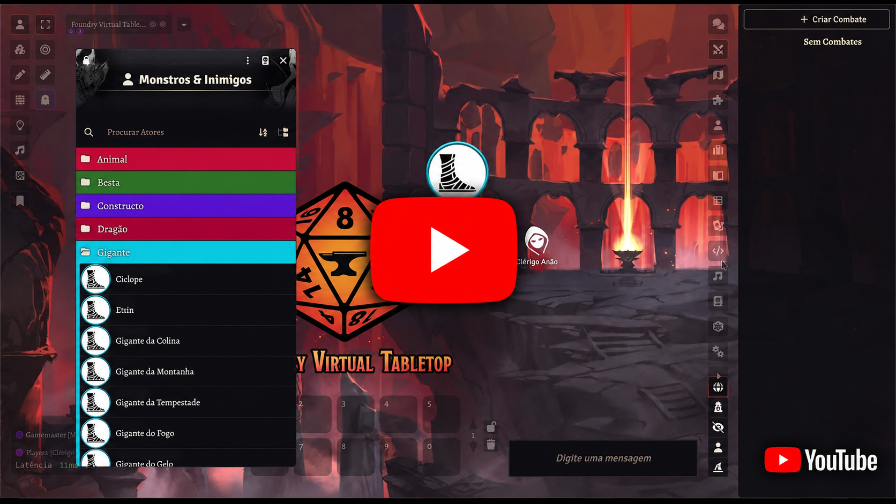

# Old Dragon 2: Qualidade de Vida

Módulo comunitário para Foundry VTT que reúne automações opcionais para o sistema **Old Dragon 2ª Edição**.

## Conjuntos de regras

Cada conjunto pode ser ativado ou desativado em **Configurações do jogo → Configurar ajustes → Configurações de módulo**.

[](https://youtu.be/R_b9y9a12qI)

### Gerenciador de efeitos OD2

- Cria efeitos persistentes ou temporários diretamente nos atores.
- Inclui o compêndio **QdV: Efeitos**, organizado nas pastas Raça, Classe, Magia e Equipamentos; seus modelos podem ser arrastados para as listas de efeitos Temporários, Passivos ou Inativos.
- Equipamentos possuem uma seção própria de efeitos; ao equipar, novas cópias vinculadas são adicionadas ao ator e, ao desequipar, essas cópias são apagadas. Equipar novamente recria os efeitos com duração e rolagens reiniciadas, preservando os usos já consumidos.
- Automatiza **Inimigos** do Anão, **Arma Racial** e **Bastião Racial** do Anão Aventureiro, incluindo inclusão e remoção conforme raça, classe e nível.
- Adiciona as rolagens públicas de **Mineradores** e **Reputação** e usa d12 nos PV do Anão Aventureiro a partir do 3º nível no gerador de personagens.
- Modifica CA, BAC, BAD, JPD, JPC, JPS, ataques e dano sem depender do DAE.
- Controla efeitos por rodadas, turnos, tempo do mundo ou até o próximo descanso.
- Mantém origem, descrição e notas exclusivas do Mestre para cada efeito.
- Permite regras condicionais com Quando, Se, Enquanto, Então e Senão, comparando PV, atributos, nível, CA, ataques, JPs e condições presentes no ator.
- Executa ações de PV com fórmulas de dados, mensagens no chat ou ativação e desativação de outros efeitos pelo nome.
- Oferece gatilhos de ataque, dano, magia, descanso, 20 natural e subida de nível, com seleção de alvos, distância, aura e ambiente.
- Controla usos, recuperação no descanso, ataques extras, preparação de magia, invocações e transformações visuais reversíveis.
- Pode copiar um efeito para os atores selecionados — como alvos de uma magia — e apagá-lo automaticamente ao terminar sua duração.
- Usa as medidas oficiais de tempo do Old Dragon: rodadas de 10 segundos no combate e turnos de 10 minutos fora dele; o Combat Tracker avança o relógio do mundo a cada rodada.

### Automação de combate

- Intercepta ataques das fichas de personagens e monstros.
- Compara o ataque com a CA do alvo e registra acerto ou erro no chat.
- Rola e aplica dano, com ajustes de fraqueza e resistência.
- Trata acertos e erros críticos pelas opções do LB1/LB2.
- Automatiza **Aparar** do Bárbaro: Mestre e jogador recebem a decisão antes da divulgação do ataque e do dano; aceitar interrompe o golpe.
- Ao chegar a 0 PV, personagens recebem o status **Inconsciente** e ficam impedidos de atacar ou mover o token.
- No início das rodadas seguintes, solicita pelo chat uma jogada de agonização usando o maior total entre JPC e JPS.
- A agonização usa a regra de Jogada de Proteção do OD2: resultado igual ou inferior ao valor da proteção é sucesso; falhar aplica o status **Morto**, remove Inconsciente e anuncia a morte.
- Solicita confirmação do Mestre quando o jogador não pode alterar o alvo.
- Resume criaturas derrotadas e distribui XP ao encerrar o combate.

As opções de dano automático, alvo único e permissão para jogadores permanecem configuráveis separadamente.

### Equipamentos em recipientes

- Arraste equipamentos sobre Barris, Mochilas e outros itens do tipo `container` para guardá-los.
- Recipientes podem ser aninhados, com proteção contra ciclos.
- A ficha do recipiente permite reservar moedas, que continuam compondo o saldo disponível do personagem.
- Ao transferir um recipiente para outro personagem ou ajudante, toda a árvore de itens e as moedas guardadas são movidas em conjunto.
- Cada equipamento possui um ícone de transferência ao lado dos controles de edição; itens equipados precisam ser desequipados antes da transferência.
- **Esvaziar recipiente** devolve todos os itens à lista principal e mantém as moedas com o personagem.
- A exclusão de um recipiente preenchido exige confirmação e remove seu conteúdo em conjunto.

### Monstros carregam itens

- Adiciona a aba **Equipamentos** às fichas de monstros.
- Permite arrastar equipamentos dos compêndios ou de outras fichas para o inventário do monstro.
- O Mestre pode transferir itens entre monstros, personagens e ajudantes.
- Itens podem ser equipados, abertos e excluídos diretamente pela aba.
- Monstros possuem uma carteira própria de PO, PP e PC, mesmo que a função de recipientes esteja desativada.
- Com **Equipamentos em recipientes** ativo, recipientes mantêm itens aninhados e moedas durante todas as transferências; monstros recebem uma carteira própria do módulo.

### Tomo de Magia

- Incorpora os compêndios de magias arcanas, divinas, selvagens, de missão e cooperativas do [Tomo de Magia OD2](https://github.com/rangelsardinha/tomo-de-magia-od2).
- Inclui navegador com filtros por círculo, escola e esfera no diretório de Itens.
- Disponibiliza tabelas, regras e PDFs de consulta do Tomo de Magia.
- Automatiza a variação de nível e os surtos ao lançar Magias Selvagens.
- Pode ser habilitado ou desabilitado independentemente das demais funções do QdV.
- Ao usar esta versão incorporada, desative o módulo separado `tomo-de-magia-od2` para evitar duplicidades.

### Gerador de pergaminhos

- Adiciona **Gerar Pergaminho** ao diretório de Itens para o Mestre.
- Permite escolher tradição arcana, divina ou ambas e definir o círculo máximo.
- Usa magias do SRD; com **Tomo de Magia** habilitado, permite escolher SRD, Tomo ou ambas as fontes.
- Oferece modo manual, no qual o Mestre arrasta magias específicas para dentro do pergaminho.
- Sorteia uma magia em 80% dos resultados, duas em 15% e três em 5%.
- O Mestre escolhe entre maldição aleatória (10%), pergaminho amaldiçoado (caótico) ou não amaldiçoado.
- O efeito da maldição fica marcado no item, mas só é exibido na interface do Mestre.
- Cada magia possui link para seu documento e um botão **Usar**; o uso publica o cartão da magia no chat e consome o pergaminho.
- Ao usar um pergaminho amaldiçoado, o efeito é enviado por mensagem privada somente aos Mestres.
- O resultado pode ser transferido diretamente para um personagem ou ajudante.

### Carta de Controle de Sessão

- Adiciona **Nova Carta de Controle** ao diretório de Diários para o Mestre.
- Organiza quatro horas de exploração em turnos de 10 minutos.
- Ao marcar um turno, avança 10 minutos no relógio do mundo e atualiza automaticamente a duração dos efeitos temporários.
- Automatiza rolagens secretas de encontro e avisos de descanso, tochas e lanternas.
- Mantém notas públicas e notas privadas exclusivas do Mestre.
- Reconhece cartas criadas pelo antigo módulo independente `carta-de-controle-de-sessao-od2`.
- Ao usar esta versão incorporada, desative o módulo separado para evitar eventos duplicados.

### Gerador de personagens

- Adiciona **Criar novo personagem** ao diretório de Atores para o Mestre.
- Define nome, jogador proprietário e raça a partir do compêndio oficial do SRD.
- Oferece os estilos Clássico, Aventureiro, Heroico, 3d6 Duplo, Camponês, Distribuição e Racial.
- Permite distribuir resultados quando o método escolhido admitir e aplica os atributos confirmados à ficha.
- Filtra classes pelas restrições raciais oficiais e sincroniza habilidades de raça e classe.
- Configura nível, XP mínimo do nível, PV com dado de vida e Constituição e renda inicial editável.
- Ao concluir, abre a ficha e orienta o jogador a escolher equipamentos e magias.
- Jogadores podem solicitar a criação; o Mestre autoriza o início, cada rerrolagem e o resumo final diretamente pelo chat.

### Habilidades de raça e classe automatizadas

- **Acadêmico:** Conhecimento Acadêmico, Decifrar Linguagens, Lendas e Tradições, Identificar Itens e Reputação, com progressão por nível e rolagens secretas quando aplicável.
- **Anão:** Mineradores e Inimigos; **Anão Aventureiro:** Arma Racial, Bastião Racial, Duro na Queda e Reputação.
- **Elfo e Meio-Elfo:** Imunidade a Sono e Paralisar; **Arqueiro:** Maestria em Armas e Puxada Aprimorada.
- **Halfling:** Furtivos, Bons de Mira e Pequenos; versões Athasianas são reconhecidas quando o módulo Dark Sun está ativo.
- **Meio-Gigante:** Força Descomunal e Resistência Corporal; **Aarakocra:** Nascidos dos Céus.
- **Bárbaro:** Maestria em Armas, Talentos Selvagens e Surpresa Selvagem, além da reação de Aparar integrada ao combate.
- **Assassino:** Assassinato com progressão por nível, cálculo de DV do alvo, redutores e falha automática conforme a diferença de DV.
- Efeitos associados são sincronizados automaticamente conforme raça, classe e nível; ao remover ou reduzir a associação, os efeitos correspondentes também são removidos.

### Integração com Dark Sun

- Detecta automaticamente módulos Dark Sun ativos na versão 1.0.4 ou superior.
- Acrescenta raças e classes dos compêndios Dark Sun ao gerador de personagens, identificando sua origem nas listas.
- Acrescenta magias Dark Sun às fontes do gerador de pergaminhos, isoladamente ou combinadas com SRD e Tomo de Magia.
- Equipamentos, recipientes, munições, inventários de monstros e automação de combate funcionam com itens Dark Sun sem configuração adicional.
- A integração só é carregada quando o módulo Dark Sun está ativado no mundo, pois módulos inativos não disponibilizam seus compêndios ao Foundry.
- Seleções de maestria em armas apresentam listas separadas para armas do SRD e de Dark Sun; a lista de Athas só aparece quando o módulo correspondente está ativo.

## Compatibilidade

- Foundry VTT mínimo 13, máximo 14 e verificado no Foundry VTT 14.
- Sistema `olddragon2e` 2.0.0 ou mais recente.

Para instalar localmente, copie a pasta para `Data/modules/old-dragon-2-qualidade-de-vida`, reinicie o Foundry e ative o módulo no mundo.

## Desenvolvimento

Cada automação fica isolada em `scripts/features/<nome>`. Para adicionar um novo conjunto, crie sua pasta, importe seu ponto de entrada em `module.json` e registre uma configuração `enable...` em `scripts/main.js`.

Execute as verificações com:

```sh
npm run check
```

## Licenciamento e atribuição

[Old Dragon 2ª Edição](https://olddragon.com.br), da **Old Dragon Editora**, está licenciado sob [CC BY-SA 4.0](https://creativecommons.org/licenses/by-sa/4.0/). É uma criação de Antonio Sá Neto, Dan Ramos e Fabiano Neme, baseada nos originais de Gary Gygax e Dave Arneson.

Este módulo usa apenas regras abertas do [SRD do Old Dragon 2](https://olddragon.com.br/livros/srd), segue as [diretrizes oficiais de licenciamento](https://olddragon.com.br/licenciamento) e é distribuído sob CC BY-SA 4.0. É um projeto independente da comunidade, não oficial e não endossado pela Old Dragon Editora. O projeto não usa o logotipo oficial nem imagens proprietárias dos livros.

A implementação inicial foi consolidada a partir de [OD2 Automação de Combate](https://github.com/rangelsardinha/od2-combat-automation), de Rangel Sardinha.
